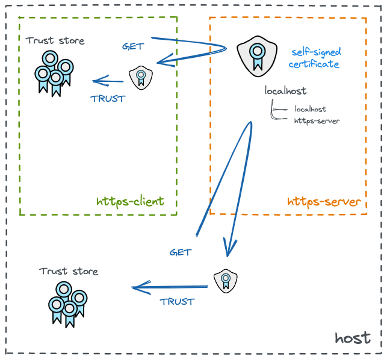
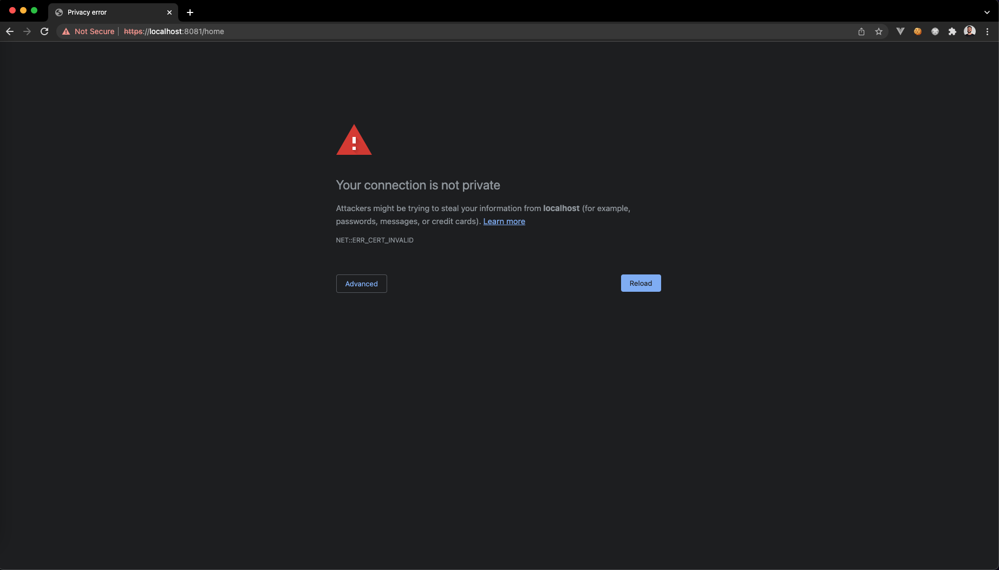
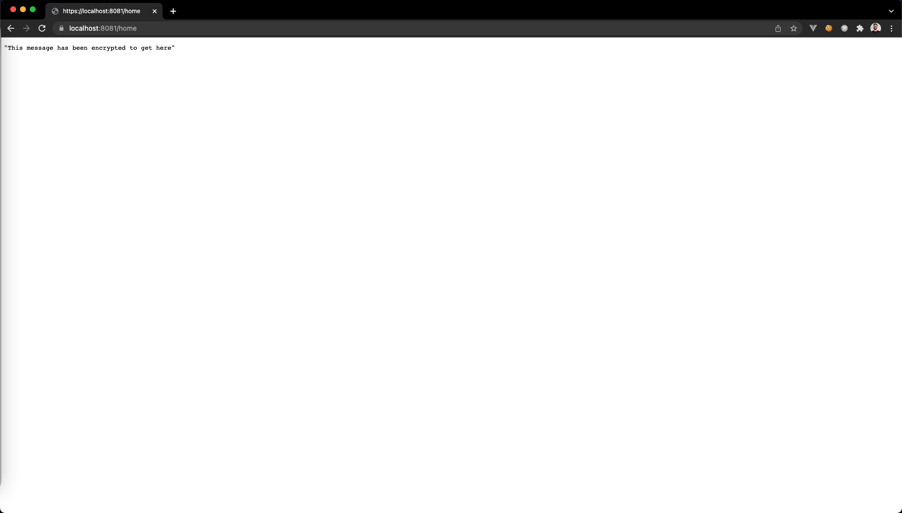

# Building a self signed certificate server in golang

This article will be useful to you if you want to create a self signed server in `golang`. There are many ways to use certificates to build and run a `https` server, this article will approach one of them: `self-signed` using openssl tool. You could see all the source code used in the current article in the public [github repository](https://github.com/luizhlelis/go-lang-https-self-signed).

## Why https?

Firstly let's remember some concepts. The Hypertext Transfer Protocol ([Http](https://tools.ietf.org/html/rfc2616)) specifies a standard track protocol for the internet community and has been in use since 1990. The problem with the use of only http is that the exchanged messages between server and client will not be encrypted, so everyone who intercepts those messages will know exactly what that messages means and also can modify the data to masquerade as one of the peers involved. To avoid attacks like [man-in-the-middle](https://tools.ietf.org/html/rfc4949) and to provide private communication, the Secure Sockets Layer ([SSL](https://tools.ietf.org/html/rfc6101)) was first introduced by Netscape in 1994 being the pioneer in secure communications protocols, but it was succeeded later by the Transport Layer Security ([TLS](https://tools.ietf.org/html/rfc8446)). TLS is the channel-oriented security protocol currently in use on the internet and it's composed basically by two protocols: the handshake and the record protocol.

The TLS Handshake protocol is responsible to authenticates two end-points, besides that, it also negotiates cryptographic parameters and generates keying material. The record protocol uses the parameters established by the handshake protocol to protect traffic between the end-points.

## Why self signed?

By default your operation system trusts in a set of certification authorities (CA) like GlobalSign, Let's Encrypt, Digicert, GoDaddy, etc. The self-signed certificates are those that aren't signed by any CA, in this case, the certificate is signed with its own private key, instead of requesting it from a CA. So in that case, the client should trust in the certificate issued by the server.

The first thing you need to ask yourself is: why do I need a self signed certificate? There are few reasons for that and I've never faced a reason to use it in a production environment. So maybe you're thinking: so on, what is this article for? There are some scenarios which demands you to provide a `https` endpoint (to run your application locally for example). In my case, I needed it to run an application locally to integrate it with a cloud service that requires a `https` endpoint. There are some frameworks, SDKs or tool kits written in other languages that provides to you an `https` endpoint natively with self-signed certificates (it's the case of [JDK](https://www.oracle.com/java/technologies/downloads/) and [.NET Core](https://dotnet.microsoft.com/en-us/download)), but I didn't find anything like that in `golang`.

> **NOTE:** if you're gonna use `https` in production, I strongly recommend you to use a certificate signed by a CA (try to use a cloud solution like [AWS Certificate Manager](https://aws.amazon.com/pt/certificate-manager/), or an open source tool like [certbot](https://certbot.eff.org/)). There are some security risks that you should be aware of when using self-signed, you can see more about it [here](https://www.keyfactor.com/blog/self-signed-certificate-risks/).

## Running the project

> "Talk is cheap, show me the code" - Linus Torvalds

To proceed with the next steps, you're gonna need to clone [this github repo](https://github.com/luizhlelis/go-lang-https-self-signed). The current example is composed by a server and a client called `https-server` and `https-client` respectively. Each one runs in its specific container, the server provides a REST API written in golang and is responsible to create the self signed certificate. That certificate protects two hostnames: `localhost` and `https-server`, that multi-domain approach is possible thanks to the [Subject Alternative Names](https://www.digicert.com/faq/subject-alternative-name.htm) (SANs). Take a look at the diagram below that represents the current example:



As you can see above, the server generates the certificate and the clients trust that certificate (client container or a client running in the host). So, to up the client and server containers, run the command below:

``` bash
docker-compose up
```

## Server

The command above will firstly up the server container and run some commands from a file called [generate-certificate.sh](https://github.com/luizhlelis/go-lang-https-self-signed/blob/main/server/scripts/generate-certificate.sh). That bash file contains some [openssl](https://www.openssl.org/) commands to create the self signed certificate. First, it generates a `servercert.key` and `servercert.csr` which are respectively: the private key and the certificate signing request (CSR) that contains the public key. The `CN` field in `-subj` is very important because some browsers like chrome require that information (`CN` means Common Name, that's the domain name you would like to have SSL secured). Then, the certificate file will be generated also, this file, named `servercert.crt`, is generated by the last command in the bash file. That's the self-signed certificate signed by your own `servercert.key` private key. The `x509` flag states the standard format of an SSL/TLS certificate, the `X.509` format. Finally, the `https` server are gonna get up by the `go run main.go` command. Take a look at the bash commands bellow:

```bash
apk update && apk add openssl && rm -rf /var/cache/apk/*
openssl req -new -subj "/C=US/ST=California/CN=localhost" \
    -newkey rsa:2048 -nodes -keyout "$FILE_CERT_NAME.key" -out "$FILE_CERT_NAME.csr"
openssl x509 -req -days 365 -in "$FILE_CERT_NAME.csr" -signkey "$FILE_CERT_NAME.key" -out "certificates/$FILE_CERT_NAME.crt" -extfile "self-signed-cert.ext"
```

the `ext` file has all tha SANs protected by the certificate:

```txt
subjectAltName = @alt_names
[alt_names]
DNS.1 = localhost
DNS.2 = https-server
```

Now that you already have the certificate, you need to serve your https server. Inside the `main.go` file, the `ListenAndServeTLS` method is responsible for use the cert and key to serve the `https` self signed server:

``` go
func handleRequests() {

  tlsCert := os.Getenv("tls-certificate")
  tlsKey := os.Getenv("tls-key")
  serverPort := os.Getenv("server-port")

  router := mux.NewRouter().StrictSlash(true)
  controllers.HandleHomeRoutes(router, "https")

  log.Fatal(http.ListenAndServeTLS(serverPort, tlsCert, tlsKey, router))
}
```

Along with that, as the cert and key was gotten from the `.env` file, you should declare both paths:

``` env
tls-certificate="certificates/servercert.crt"
tls-key="servercert.key"
```

## Client

The client container has a volume with the path where the server certificate was generated: `./server/certificates:/certificates`. That's because the client needs to trust that certificate to make `https` calls to the server. The command `update-ca-certificates` is responsible to add that certificate to the system's trust store, it was executed in [trust-server-certificate.sh](https://github.com/luizhlelis/go-lang-https-self-signed/blob/main/client/scripts/trust-server-certificate.sh#L11) bash file. After that, the client will be able to call the server with https (the handshake will happen normally). The `https-client` container calls the `/home` endpoint from the server with https two times after trusting its certificate, take a look at the `curl` calls in [get-server-home.sh](https://github.com/luizhlelis/go-lang-https-self-signed/blob/main/client/get-server-home.sh) file:

```bash
#!/bin/ash
echo "Installing curl package"
apk update && apk add curl && rm -rf /var/cache/apk/*
echo "Two requests below to get https server home"
sleep 10
curl https://https-server:8081/home
sleep 20
curl https://https-server:8081/home
```

## Call the server with a client running locally (localhost)

As mentioned before, you need to trust the server certificate in your local trust store if you want to use https. If you're using a linux based OS, you should run the commands shown in `trust-server-certificate.sh` file. Otherwise, follow one of the steps below:

- [Mac Os](https://tosbourn.com/getting-os-x-to-trust-self-signed-ssl-certificates/)

- [Windows](https://superuser.com/questions/370217/trust-ssl-certificate-to-local-system-account)

- [Linux](https://unix.stackexchange.com/questions/90450/adding-a-self-signed-certificate-to-the-trusted-list)

If you call a server endpoint before trusting the server certificate, you'll get an error like the following in your browser:



after trusting the certificate locally, you'll get the response with a 200 Ok status code:



if you expand the certificate, you will see all the domains secured by the self-signed certificate:


that behavior is also shown in the server stdout, before trusting the certificate there is a handshake error, but after trusting it, the handshake is successful:

```bash
https-server | 2022/02/07 00:59:53 http: TLS handshake error from 172.19.0.1:55672: remote error: tls: unknown certificate
https-server | Home page endepoint hit
```

## References

Digicert; [Multi-Domain (SAN) Certificates - Using Subject Alternative Names](https://www.digicert.com/faq/subject-alternative-name.htm)

Globalsign; [The Dangers of Self-Signed SSL Certificates](https://www.globalsign.com/en/ssl-information-center/dangers-self-signed-certificates)

Keyfactor; [What is a Self-Signed Certificate? Advantages, Risks & Alternatives](https://www.globalsign.com/pt-br/ssl-information-center/what-are-certification-authorities-trust-hierarchies)

OpenSSL; [Cryptography and SSL/TLS Toolkit](https://www.openssl.org/)

RFC 2616; [Hypertext Transfer Protocol -- HTTP/1.1](https://tools.ietf.org/html/rfc2616)

RFC 4949; [Internet Security Glossary, Version 2](https://datatracker.ietf.org/doc/html/rfc4949)

RFC 6101; [The Secure Sockets Layer (SSL) Protocol Version 3.0](https://tools.ietf.org/html/rfc6101)

RFC 8446; [The Transport Layer Security (TLS) Protocol Version 1.3](https://datatracker.ietf.org/doc/html/rfc8446)
